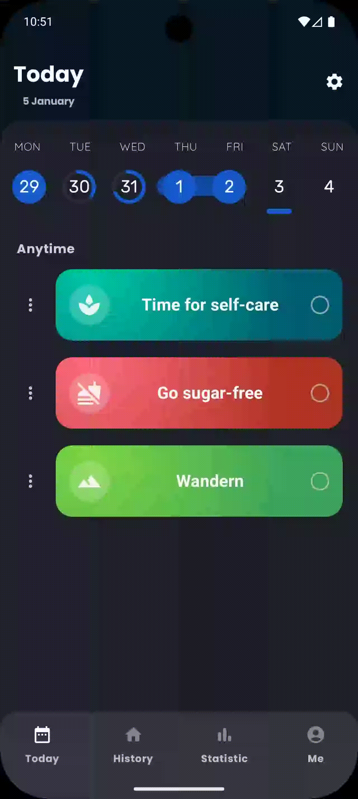
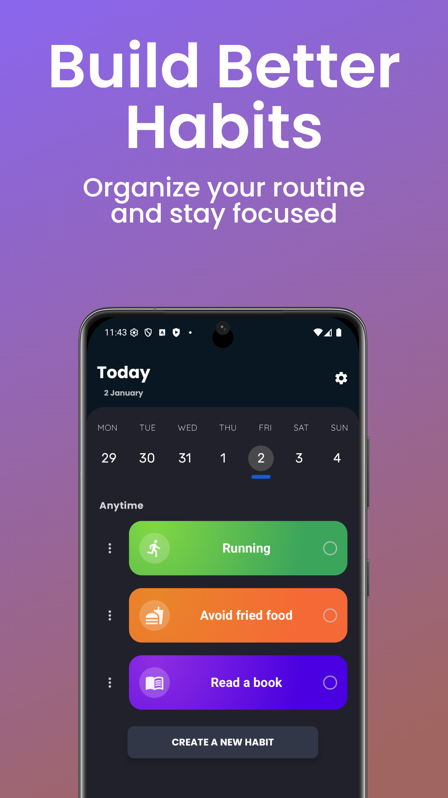
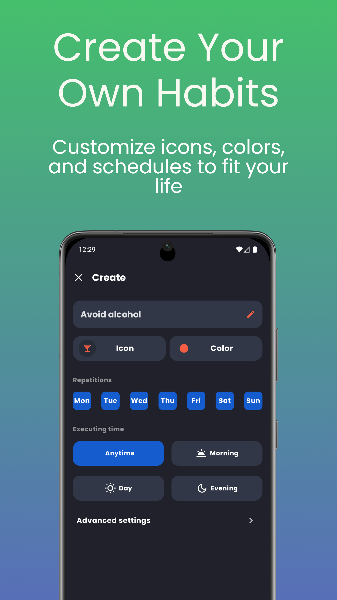
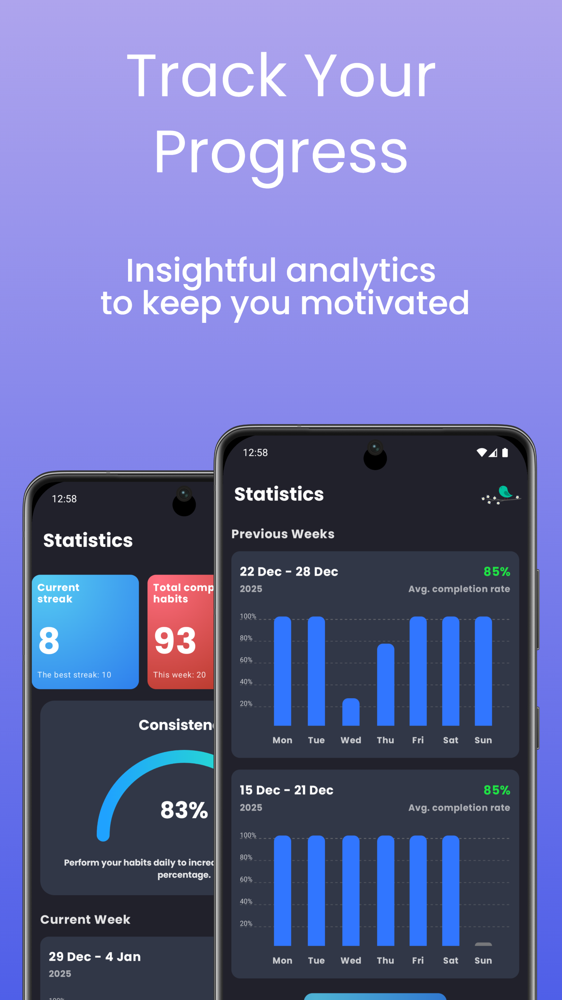
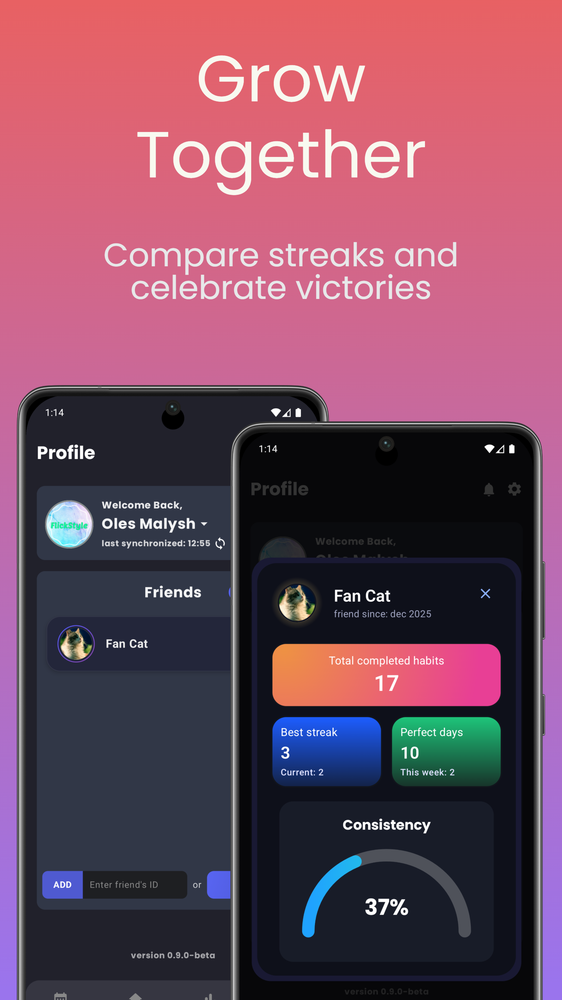
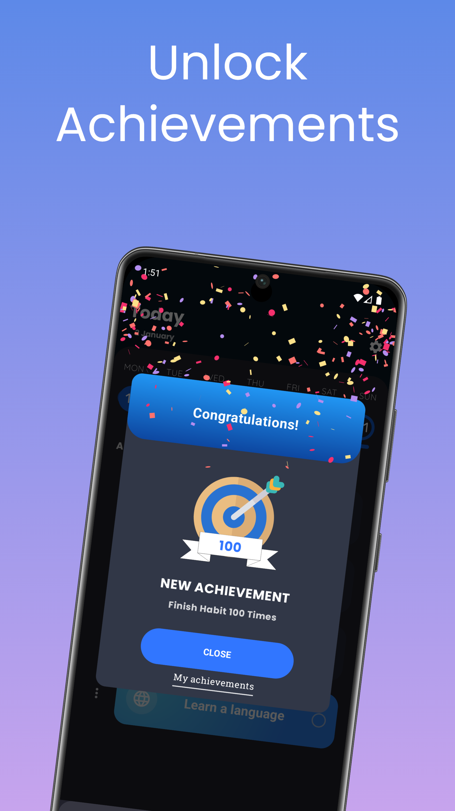
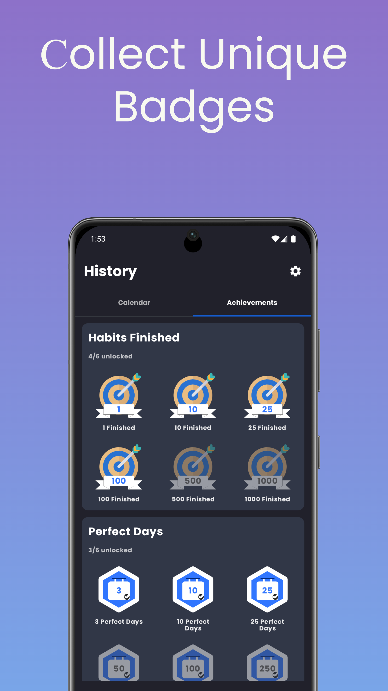

# Habits tracker

### Welcome to the Habit Tracker app, designed to help you build and maintain healthy habits effortlessly!

#### The application is in the final stage of development, so the final interface may differ slightly from the one presented. An official release on **Google Play Market** is planned in the near future.

## Overview

The Habit Tracker app allows users to monitor their daily habits, set reminders, and visualize their progress. Whether you want to cultivate new habits or break old ones, this app is your personal companion on your journey to self-improvement.

## ✨ Features

- **Habit Creation:** Easily add new habits with customizable settings such as colors, icons, and flexible reminders.

- **Daily Tracking:** Mark your habits as completed, track your daily streaks, and build long-term consistency.

- **In-depth Statistics:** Visualize your success with detailed charts and analytics that show your progress

- **Google Authentication:** Secure and quick login using your Google account for a personalized experience.

- **Cloud Synchronization:** Never lose your data! Your habits and progress are seamlessly synced across all your devices in real-time.

- **Friendship System:** Build habits together! Connect with friends, follow their journey, and stay motivated through social accountability.

- **User-Friendly Interface:** Enjoy a modern, intuitive UI built with Jetpack Compose, featuring smooth transitions and beautiful animations.

## 🚀 How to Use

1. **Get Started:** Launch the app and tap the "Add Habit" button. Give your habit a name, choose a vibrant color, pick a meaningful icon, and set up reminders to stay on track from day one.

2. **Daily Tracking:** Open the app daily to see your "Today" list. Simply tap on a habit to mark it as completed and watch your **streaks** grow as you build a healthier lifestyle!

3. **Analyze Your Progress:** Visit the **Statistics** section to see detailed charts. Evaluate your performance over the last week or month to identify patterns and improve your consistency through data-driven insights.

4. **Google Account & Sync**: Sign in securely with your Google Account. This automatically sets up your cloud profile, ensuring your data is always safe, backed up, and instantly synced across all your devices.

5. **Connect with Friends**: Navigate to the Social tab to find and add friends. You can see each other's progress, providing that extra boost of motivation and social accountability.

## Visual Showcase

<table>
  <tr>
    <td align="center"></td>
    <td align="center"></td>
    <td align="center"></td>
  </tr>
  <tr>
    <td align="center"></td>
    <td align="center"></td>
    <td align="center"></td>
  </tr>
</table>

## 🛠 Technologies Used

- **Kotlin** — modern, expressive, and safe programming language.

- **Jetpack Compose:** — modern UI framework for building native UI using a declarative approach.

- **Dagger Hilt** — standard library for Dependency Injection in Android that simplifies architectural layers.

- **Backend & Auth:** \* **Google Authentication:** Secure user sign-in and account management.

  - **Firebase:** Used for cloud data synchronization and real-time database updates.

- **Room Database** — an abstraction layer over SQLite for robust local data persistence.

- **MVVM (Model-View-ViewModel):** architectural pattern to ensure clean separation of responsibilities.

- **Navigation Component:** Seamless navigation between Compose screens.

- **Kotlin Coroutines & Flow** — for efficient background tasks and reactive data streams.

## Installation

1. Clone the repository.
2. Open the project in Android Studio.
3. Run the app on an emulator or physical device.
